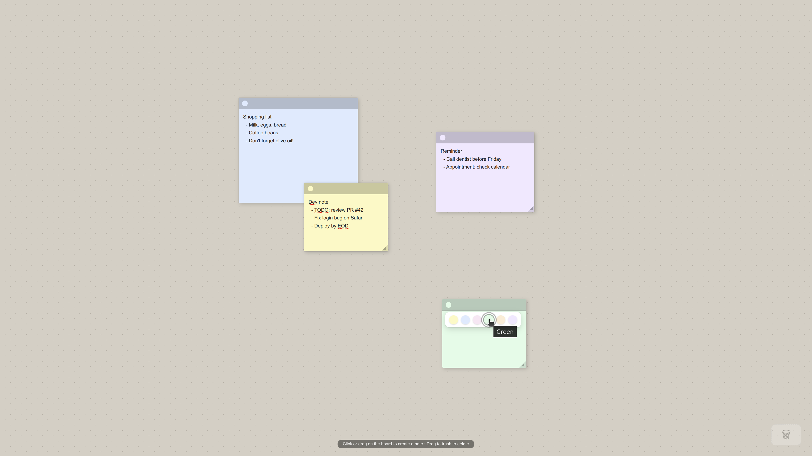

# Sticky Notes

A single-page sticky notes application built with Bun, Vite, React 19, and TypeScript.



## Overview

- **Create** notes by clicking or click-dragging on the board canvas
- **Move** notes by dragging their header bar
- **Resize** notes by dragging the bottom-right corner handle
- **Delete** notes by dragging them onto the trash zone (bottom-right)
- **Edit** text directly in each note
- **Change colors** via the color dot in the note header
- Notes are cached in **localStorage** immediately and synced to the **REST API** in the background

## Requirements

- [Bun](https://bun.sh/) ≥ 1.1

## Installation

```bash
# Install all workspace dependencies from the repo root
bun install
```

## Running in Development

The app requires both the API server and the Vite dev server to be running.

**Option A — single command (runs both in background):**
```bash
bun run dev
```

**Option B — separate terminals (recommended for cleaner logs):**
```bash
# Terminal 1 — API server on http://localhost:3001
bun run dev:server

# Terminal 2 — Vite dev server on http://localhost:5173
bun run dev:client
```

Open [http://localhost:5173](http://localhost:5173) in your browser.

## Building for Production

```bash
bun run build
# Output is in client/dist/
```

## API Endpoints

| Method | Path             | Description         |
|--------|-----------------|---------------------|
| GET    | /api/notes       | List all notes      |
| POST   | /api/notes       | Create a note       |
| PUT    | /api/notes/:id   | Update a note       |
| DELETE | /api/notes/:id   | Delete a note       |

> The server stores notes in memory — data is lost on restart. localStorage provides persistence across page reloads.

## Project Structure

```
tempo-notes/
├── server/src/index.ts      # Bun HTTP server
└── client/src/
    ├── types.ts             # Shared type definitions
    ├── api/notes.ts         # REST API client
    ├── hooks/useNotes.ts    # State + sync logic
    ├── components/
    │   ├── Board.tsx        # Canvas + drag-to-create
    │   ├── Note.tsx         # Note card
    │   ├── ColorPicker.tsx  # Color swatches
    │   └── TrashZone.tsx    # Delete drop target
    └── styles/globals.css   # All styles
```
